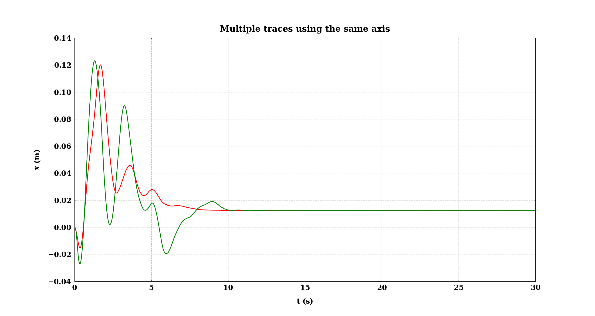

# HOW TO USE `easy_plots.py`

`easy_plots.py` can be used to make line plots with one or multiple traces using the same axis or multiple axes into the same figure, in both
2D and 3D. `easy_plots` require [`aquarel`][2] to use beautiful themes and as a way to easily define new themes, whether you don't want to install that additional package,
you should use the `matplotlibrc` file to use a predefine theme compatible with IEEE publications or to define one by yourself.

## How to use `easy_plots`
Prepare a new python script. Use the `GENERAL_PATH` object whether you have all the files that you will use, in the same path, otherwise you will need to specify the path for each file separately.

`easy_plots` have four functions that you can use to plot one or multiple line traces all in the same axis or using multiple axis in the same figure. It can be used to plot 3D line traces and to record videos with line traces animations in 2D and 3D (coming).

With `aquarel` you can use a beautiful set of themes, create your own theme or modified existing ones as in the example below. If you prefer to avoid the installation of the aquarel package, you can use the `matplotlibrc` to manage the appearance of the plots. Here you have a `matplotlibrc` file with a theme compatible with IEEE publications.

The next step, is to call the functions that you want to use as in the instructions below.

```python
#!/usr/bin/env python3

import os
from aquarel import load_theme
from easy_plots import GENERAL_PATH
from easy_plots import single_axis_2D, single_axis_3D, multiple_axis_2D, animate

if __name__ == '__main__':
    GENERAL_PATH.path = os.path.dirname(
        '../../experiments/results/save-Test-NEW-FROM-SCRATCH-03.27.2024_09.34.31/'
    )

    theme = (
        load_theme('scientific')
        .set_font(family='serif', size=20)
        .set_title(pad=20)
        .set_axes(bottom=True, top=True, left=True, right=True, xmargin=0, ymargin=0, zmargin=0, width=2)
        .set_grid(style='--', width=1)
        .set_ticks(draw_minor=True, pad_major=10)
        .set_lines(width=2.5)
    )
    theme.apply()
```

## How to plot one single trace or multiple traces into the same axis

The `single_axis_2D` function allows you to plot one or multiple 2D traces, all in the same axis.

`single_axis_2D` takes as arguments: 
- **files:** a list with the name of at least one _csv_ file that should contain two columns, the 
first one with the _x_ data and the second one with the _y_ data. 
- **references:** whether you need add to the plot reference guides as comparison, the `references` argument is a dictionary containing two keys:
  - `view` (`True` or `False`) to show or not the reference guides.
  - `files` a list of _csv_ files with the coordinates (two columns) of the references guides. It can be avoided if `view` is set to `False`.
- **colors:** a dictionary with two keys: 
  - `color_mode` (`custom` or `auto`). Whether `color_mode` is set to `custom`, the color assignation will the use the color list 
    contained in the _matplotlibrc_ file or the selected theme from `aquarel` (see `axes.prop_cycle` in _matplotlib.rc_ file) and `color_list` could be avoided. Find a list of color names in [Matplotlib color names][1].
  - `color_list`, a list with the colors that will be used to draw the traces. Colors can be specified using 
    names ('red', 'green', 'blue', etc.), a hexadecimal string ('1f77b4') or four components tuple (RGBa) with values 
    between 0 and 1. 
- **settings:** a dictionary with two keys:
  - `limits` a dictionary with keys: `mode` (`custom` or `auto`). Whether you use `auto`, the length of each axis will be set using max and min values from the data, with `custom` should be added the keys `x_range` and `y_range`, each one with a tuple specifying the length of the correspondent axis as value.
  - `labels` a dictionary with three keys: `x_label`, `y_label`, `title` each one with a string as a value. 

```python
single_axis_2D(
        files=[
            'save-flight-starting-from-x0y1z0-03.19.2024_15.26.29/x0.csv',
            'save-flight-starting-from-x0y1z2-03.19.2024_15.52.13/x0.csv'
        ],
        references=dict(view=False),
        colors=dict(
            color_mode='custom',
            color_list=['red', 'green']
        ),
        settings=dict(
            limits=dict(mode='auto'),
            labels=dict(
                x_label='t (s)',
                y_label='x (m)',
                title='Multiple traces using the same axis'
            )
        )
    )
```


## How to plot one single trace or multiple traces in 3D
The `single_axis_3D` has the same arguments as `single_axis_2D` with the same meaning, except for the `reference` one that doesn't exist in `single_axis_3D`. It can take one or multiple _csv_ files, each on with three columns for _x_, _y_ and _z_.


```python
    single_axis_3D(
        files=[
            'save-flight-starting-from-x0y1z0-03.19.2024_15.26.29/test_3D.csv',
            'save-flight-starting-from-x1ym1z2-03.26.2024_16.52.52/test_3D.csv',
            'save-flight-starting-from-xm05ym075z0-03.26.2024_17.27.35/test_3D.csv'
        ],
        colors=dict(color_mode='auto'),
        settings=dict(
            limits=dict(
                mode='custom',
                x_range=(-1, 1),
                y_range=(-1, 1),
                z_range=(0, 2)
            ),
            labels=dict(
                x_label='x (m)',
                y_label='y (m)',
                z_label='z (m)',
                title="Trajectory From [0 1 0]"
            )
        )
    )
```
## How to plot 2D traces using multiple axis in the same figure

**NOTE:** The `matplotlibrc` file

[1]: https://matplotlib.org/stable/gallery/color/named_colors.html
[2]: https://github.com/lgienapp/aquarel?tab=readme-ov-file